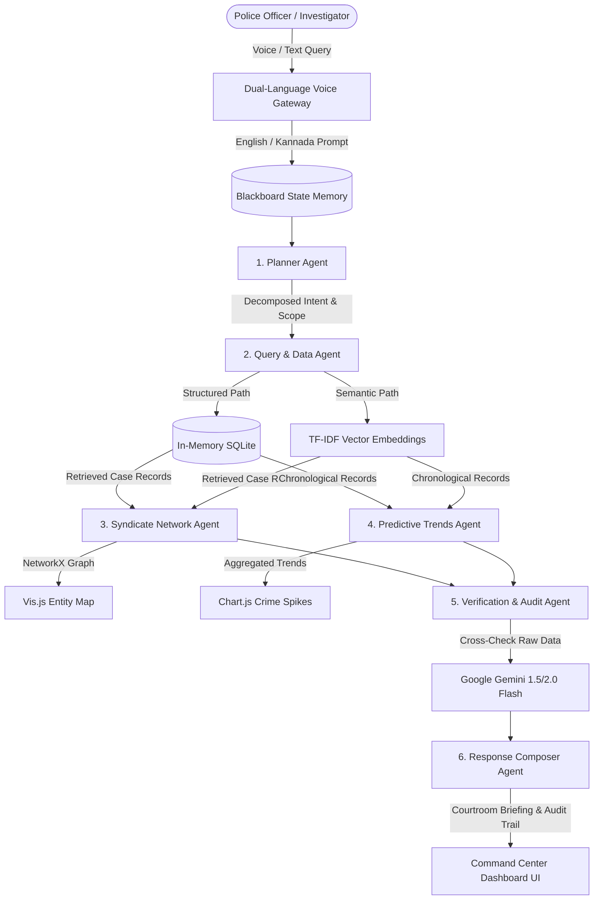

# 🛡️ KSP Crime AI — Autonomous Multi-Agent Crime Intelligence Platform

[](https://www.python.org/)
[](https://fastapi.tiangolo.com/)
[](https://python.langchain.com/)
[](https://ai.google.dev/)
[](https://catalyst.zoho.com/)

[](https://hackthon-60080002915.development.catalystserverless.in/app/index.html)
[](https://www.youtube.com/watch?v=sW60jRzMFrA)

> An enterprise-grade, autonomous multi-agent intelligence platform empowering police command centers with real-time criminal syndicate network mapping, predictive crime spike analytics, verification audits, and dual-language voice interaction.

---

## 📌 Executive Summary

**KSP Crime AI** solves the critical challenge of fragmented First Information Reports (FIRs) and cross-jurisdictional crime tracking. Powered by a **7-agent LangGraph orchestrator** and **Google Gemini LLM reasoning**, the platform ingests complex crime datasets to automatically reconstruct criminal rings, forecast localized crime spikes, verify evidentiary facts against raw records to guarantee **zero AI hallucinations**, and offer hands-free voice input in **Kannada (`kn-IN`)** and **English (`en-IN`)**.

---

## 🎬 Live Demo & Video Walkthrough

> **Live Production Deployment**: [https://hackthon-60080002915.development.catalystserverless.in/app/index.html](https://hackthon-60080002915.development.catalystserverless.in/app/index.html)

[](https://www.youtube.com/watch?v=sW60jRzMFrA)

*Click the image above to watch the full technical demonstration video on YouTube.*

---

## ✨ Key Features & Capabilities

- 🗣️ **Dual-Language Voice Gateway**: Native Web Speech API integration supporting hands-free voice input in **Kannada** and **English** with automatic fallback.
- 🕸️ **Force-Directed Syndicate Network Mapping**: Dynamic entity relationship graphs built with **NetworkX** and **Vis.js**, mapping links between suspects, accomplices, victims, and crime scenes.
- 🔎 **Hybrid Search Engine**: Dual-path processing combining parameterized **SQLite SQL execution** for structured data filtering and **SentenceTransformers / TF-IDF vector similarity** for semantic search.
- 🛡️ **Strict Hallucination Verification**: Dedicated Verification Agent cross-checks every generated claim against raw dataset records, validating suspect names, FIR IDs, and timestamps for courtroom compliance.
- 📈 **Predictive Crime Analytics**: Automated monthly crime frequency calculation and spatial hotspot distribution using **Pandas** and **Chart.js**.
- ☁️ **Cloud Deployment**: Deployed on **Zoho Catalyst Web Client** for ultra-fast, high-availability delivery.

---

## 🏛️ Autonomous Multi-Agent System Architecture

The platform uses a **Blackboard State Memory Architecture** orchestrated via **LangGraph**, where seven specialized AI agents collaborate asynchronously:



### 🤖 Agent Directory & Roles

1. **Dual-Language Voice Gateway**: Captures spoken queries in Kannada or English using browser speech recognition.
2. **Planner Agent**: Deconstructs raw user prompts into investigative sub-tasks, identifying temporal and spatial scope.
3. **Query & Data Retrieval Agent**: Executes dual-path SQL and semantic vector search across historical crime datasets.
4. **Syndicate & Network Graph Agent**: Extracts entity relationships, calculates node centrality, and identifies criminal ringleaders.
5. **Predictive Trends & Analytics Agent**: Computes monthly crime frequency spikes and high-risk hotspot shares.
6. **Verification & Hallucination Audit Agent**: Validates all generated claims against raw database records to eliminate AI hallucinations.
7. **Response Composer Agent**: Synthesizes verified findings into a courtroom-ready executive briefing with clickable case audit trails.

---

## 💻 Tech Stack

- **AI Core & Orchestration**: Google Gemini 1.5 / 2.0 Flash LLM, LangGraph, Blackboard State.
- **Backend Framework**: Python 3.10+, FastAPI, Uvicorn, SQLite, NetworkX, Pandas, Scikit-Learn.
- **Frontend Interface**: HTML5, Vanilla CSS3 (Glassmorphism), ES6 JavaScript, Vis.js Network, Chart.js.
- **Cloud Infrastructure**: Zoho Catalyst (Web Client Frontend).

---

## 📁 Repository Structure

```
.
├── backend/
│   ├── agents/            # Autonomous Agent implementations (Planner, Query, Network, Verifier, Composer)
│   ├── core/              # LLM configuration, STT, and shared blackboard state
│   ├── data/              # SQLite loader, TF-IDF vectorizer, and dataset ingestion
│   ├── graph/             # LangGraph pipeline orchestration
│   ├── routers/           # FastAPI REST API endpoints
│   ├── main.py            # Main ASGI FastAPI Application server
│   └── requirements.txt   # Python backend dependencies
├── frontend/
│   ├── index.html         # Main Command Center Interface
│   ├── script.js          # Graph rendering, API client, and Voice recognition module
│   ├── style.css          # Glassmorphic dark-mode styling system
│   ├── dashboard.html     # Analytics & Trends view
│   └── upload.html        # Dataset ingestion portal
├── catalyst.json          # Zoho Catalyst deployment config
└── requirements.txt       # Root deployment requirements
```

---

## 🚀 Quick Start Guide

### Prerequisites
- Python 3.10+
- Google Gemini API Key

### 1. Local Setup
```bash
# Clone the repository
git clone https://github.com/tharvin-byte/Dathathon-2026.git
cd Dathathon-2026

# Create virtual environment
python -m venv zoho
source zoho/bin/activate  # On Windows: zoho\Scripts\activate

# Install dependencies
pip install -r backend/requirements.txt
```

### 2. Environment Configuration
Create a `.env` file inside the root directory:
```env
GEMINI_API_KEY=your_gemini_api_key_here
```

### 3. Run Backend Server
```bash
python -m uvicorn backend.main:app --reload --port 8001
```
Open `frontend/index.html` in your web browser or access `http://127.0.0.1:8001/docs` for API documentation.

---

## 🌐 Cloud Deployment Architecture

- **Deployment**: Hosted on **Zoho Catalyst Web Client**:
  ```bash
  catalyst deploy --only client
  ```

---

## 📜 License & Acknowledgments

Developed for the **Datathon 2026**. Built with LangGraph, and Scikit-Learn.
